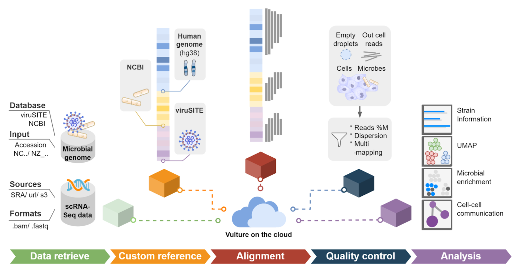

# Vulture: Scalable microbial calling pipeline on AWS Cloud

<p align="center">
  
</p>

Vulture is a scalable cloud-based pipeline that performs microbe calling for single-cell RNA sequencing data, enabling the meta-analysis of the single-cell host-microbial studies from the AWS Open Data and other public domain. We named our pipeline Vulture because Vultures are a type of bird that fly the highest above the cloud and as a scavenger can defend themselves from harmful pathogens.



## Tutorial
For how to use Vulture, please kindly refer to our hands-on tutorial page at https://juychen.github.io/

## <a name="require"></a>Requirements
Input data
* 10x Chromium scRNA-seq reads
Software
* DropletUtils >= v1.10.2
* STAR >= v2.7.9a or
* cellranger >= 6.0.0 or
* Kallisto|bustools >= 0.25.1 or
* salmon|alevin >= v1.4.0

## <a name="gen_usages"></a>General usage
Map 10x scRNA-seq reads to the viral (and microbial) host reference set using STARsolo, CellRanger, Kallisto|bustools, or Salmon|Alevin. 

### 1. Map 10x scRNA-seq reads to the viral microbial host reference set:

```
Usage: scvh_map_reads.pl [Options] <vmh_genome_dir> <R2> <R1> or <vmh_genome_dir> <.bam file>

Options:                                                                                                                                Defaults
-o/--output-dir	<string>   the output directory                                                                                          [./]
-t/--threads <int>         number of threads to run alignment with                                                                       [<1>]
-d/--database <string>     select virus or virus and prokaryotes database, can be 'viruSITE' or 'viruSITE.NCBIprokaryotes'               [<viruSITE.NCBIprokaryotes>]
-e/--exe <string>          executable command or stand alone executable path of the alignment tool                                       [<>]
-s/--soloStrand <string>   STARsolo param: Reverse or Forward used for 10x 5' or 3' protocol, respectively                               [<Reverse>]
-w/--whitelist <string>    STARsolo param --soloCBwhitelist                                                                              [<"vmh_genome_dir"/737K-august-2016.txt>]
-r/--ram <int>             limitation of RAM usage. For STARsolo, param: limitGenomeGenerateRAM unit by GB                               [<8>]
-f/--soloFeature <string> STARsolo param:  See --soloFeatures in STARsolo manual                                                        [<Gene>]
-ot/--outSAMtype <string>  STARsolo param:  See --outSAMtype in STARsolo manual                                                          [<BAM SortedByCoordinate>]
-mm/--soloMultiMappers <string>  STARsolo param:  See --soloMultiMappers in STARsolo manual                                              [<EM>]
-a/--alignment <string>    Select alignment methods: 'STAR', 'KB', 'Alevin', or 'CellRanger'                                             [<STAR>]
-v/--technology <string>   KB param:  Single-cell technology used (`kb --list` to view)                                                  [<10XV2>]
--soloCBstart <string>  STARsolo param:  See --soloCBstart in STARsolo manual                                                            [<1>]
--soloCBlen <string>  STARsolo param:  See --soloCBlen in STARsolo manual                                                                [<16>]
--soloUMIstart <string>  STARsolo param:  See --soloUMIstart in STARsolo manual                                                          [<17>]
--soloUMIlen <string>  STARsolo param:  See --soloUMIlen in STARsolo manual                                                              [<10>]
```

For alignment option 'STAR', 'KB', and 'Alevin', run:
```
perl scvh_map_reads.pl -t num_threads -o output_dir vmh_genome_dir R2.fastq.gz R1.fastq.gz
```
where -t is a user-specified integer indicating number of threads to run with, output_dir is a user-specified directory to place the outputs, vmh_genome_dir is a pre-generated viral (and microbial) host (human) reference set directory, R2.fastq.gz and R1.fastq.gz are input 10x scRNA-seq reads.

For option 'CellRanger', run:

```
perl scvh_map_reads.pl -t num_threads -o output_dir vmh_genome_dir sample fastqs
```
where sample and fastqs are two cellranger arguments: --sample and --fastqs. See documentation in [cellranger count](https://support.10xgenomics.com/single-cell-gene-expression/software/pipelines/latest/using/count) to infer rules of fastq and sample naming.

### 2. Filter the mapped UMIs using EmptyDrops to get the viral (and microbial) host filtered UMI counts matrix and also output viral genes and barcodes info files:
```
Usage: Rscript scvh_filter_matrix.r output_dir sample_name
```
where sample_name is an optional user-specified tag to be used as a prefix for the output files.

### 3. (Optional, and STARsolo or CellRanger only) Output some quality control criteria of the post-EmptyDrops viral microbial supporting reads in the BAM file
```
Usage: perl scvh_analyze_bam.pl output_dir sample_name
```
